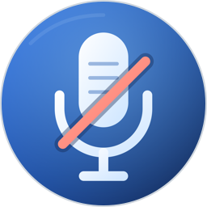

# Mic Muter

<p align="center">
  
</p>

A menu bar app for muting and unmuting your selected microphone with a click or keyboard shortcut.

## Features

- Choose an input device or follow System Default.
- Use the device's mute control, or save and restore its input level when no mute control is available.
- See six status states, an optional toggle HUD, and VoiceOver labels.
- Optionally launch at login.

## Installation

Requires macOS 14 or later. Download `MicMuter-<version>.dmg` from the [latest release](https://github.com/goerwin/mic-muter/releases/latest), open it, and drag `Mic Muter.app` to `/Applications`.

Use **Check for Updates…** in the popover to install new releases. Releases are signed with an Apple Development certificate but are not notarized. If macOS blocks the first launch, choose **Open Anyway** in **System Settings > Privacy & Security**. Sparkle verifies updates with EdDSA signatures.

## Privacy and permissions

Mic Muter does not capture, record, or send audio. It reads input device names and mute or volume controls, and changes those controls when you toggle mute. Your selected device, app settings, and saved input levels stay in local macOS preferences.

Microphone, Accessibility, and Input Monitoring permissions are not required. macOS manages **Launch at Login** under **System Settings > General > Login Items**.

## Development

Requires Xcode and `swift-format`.

```sh
make build                         # Build the app
make test                          # Run core tests and the icon smoke test
make lint                          # Check Swift formatting
make install                       # Build and install the app
make release VERSION=1.2.3         # Build a universal DMG
```

## Releases

Run `make release-patch`, `make release-minor`, or `make release-major` to preview and confirm a version tag push. Keep the working tree clean first. You can also run **Release** from the Actions tab with a tag.

Pushing a `vMAJOR.MINOR.PATCH` tag publishes `MicMuter-<version>.dmg`, `MicMuter-<version>-SHA256SUMS`, and `appcast.xml`. Verify the DMG with `shasum -c MicMuter-<version>-SHA256SUMS`.

GitHub Actions needs the repository secrets `MAC_APP_CERTIFICATE`, `MAC_BUILD_CERTIFICATE_BASE64`, `MAC_BUILD_CERTIFICATE_BASE64_PASSWORD`, and `SPARKLE_PRIVATE_KEY` to publish releases.

## License

Mic Muter's source code is licensed under the [MIT License](LICENSE). The Mic Muter name, app icon, and original brand artwork are not covered by that license and are all rights reserved. Unofficial forks and redistributions must use their own branding and must not imply endorsement or affiliation.
