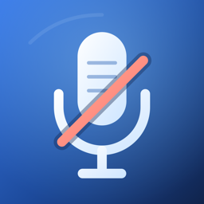

# Mic Muter



A menu-bar-only macOS app that mutes and unmutes the microphone you select. Click the menu bar icon, or assign a global shortcut.

## Features

- **Menu bar only.** No dock icon and no main window. Left-click to toggle mute; right-click opens the popover, where the device picker, shortcut recorder, and Launch at Login live.
- **Any input device.** Pick a microphone, or leave it on System Default to follow whatever macOS considers current. The list updates when devices come and go.
- **Real mute, with a fallback.** Mic Muter sets the device's own mute control when one exists. Devices exposing only a volume control, such as many webcams, are muted by dropping their input level to zero, and the previous level is restored on unmute.
- **Six-state icon.** Muted, unmuted, input-silent, unknown, unsupported, and disconnected, so a device that cannot be muted never looks like a working one.
- **Optional HUD.** Off by default. Turn on "Show HUD on Toggle" and each toggle briefly shows the new state and device name in the center of the screen, so you get confirmation without opening the popover.
- **Accessible.** Every state has its own spoken description, and the status item is labelled for VoiceOver.

## Installing

Requires macOS 14 or later. Download `Mic Muter.dmg` from the Releases page, drag `Mic Muter.app` to `/Applications`, and open it.

Releases are ad-hoc signed rather than notarized, so macOS blocks the first launch. Open **System Settings > Privacy & Security** and click **Open Anyway**; this is needed once per version. macOS 15 removed the right-click > Open shortcut, so the System Settings step is the only route.

## Development

Needs Xcode and `swift-format`.

### Architecture

- `App/` is the composition root and AppKit status-item bridge.
- `Features/Mute/` contains the observable model and pure status mapping.
- `Audio/` owns the Core Audio adapter and audio-domain types; the model uses `AudioDeviceManaging`, while mute-property I/O is injectable through `AudioDevicePropertyAccess`.
- `Services/Storage/` owns UserDefaults persistence; `Services/System/` wraps login-item and shortcut APIs.
- `State/` holds presentation state, while `UI/` contains the menu-bar, HUD, and reusable SwiftUI views.
- `Tests/MicMuterCoreTests/` exercises model behavior, status mapping, storage, and mute fallback with simulated device properties.

`AppDelegate` wires the concrete services into `MicMuterModel`. The model depends on protocols rather than AppKit, ServiceManagement, or UserDefaults directly. The SwiftPM core target excludes the app and UI so the same non-UI code can be tested independently; the app itself is built by the Xcode project.

- `make build` builds the app with Xcode.
- `make test` runs unit tests for status presentation, status mapping, persistence, and model behavior.
- `make lint` checks Swift sources with `swift-format`.
- `make install` builds from source and replaces `/Applications/Mic Muter.app`, then opens it. macOS may request an administrator password.
- `make release VERSION=1.2.0` builds a universal `dist/Mic Muter.dmg`. `VERSION` defaults to `1.0.0`.

`make install` and `make release` both ad-hoc sign, so the app runs locally without a certificate.

## Releases

Pushing a `vMAJOR.MINOR.PATCH` tag builds a universal DMG and attaches it to a GitHub Release. The tag is the only source of truth for the version.

```sh
git tag v1.0.0 && git push origin v1.0.0
```

Or trigger it from the Actions tab via *Release* > *Run workflow* with the tag you want.

Each release has two assets: `Mic Muter.dmg` (Apple silicon and Intel) and `SHA256SUMS`, which verifies with `shasum -c SHA256SUMS`.

### Release notes

Generated automatically from the commits between the new tag and the previous one, so there is nothing to write. `feat:` and `fix:` subjects are grouped under those headings; anything else is listed verbatim. Each line links to its commit. Keep commit subjects descriptive, since they become the release body.
